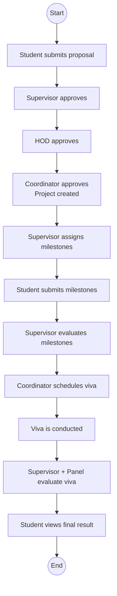
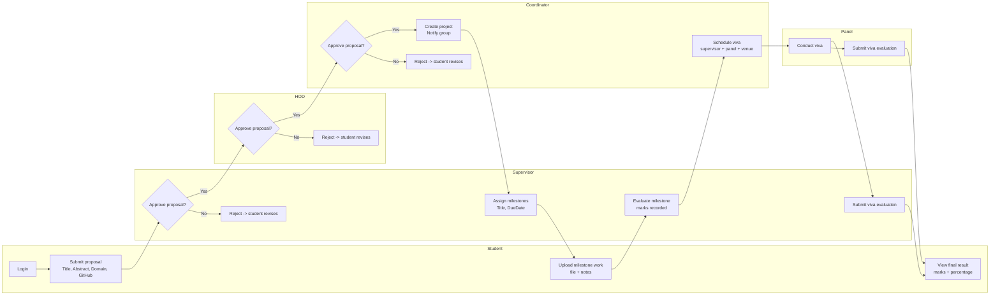

# FYP Automation System

A role-based Final Year Project (FYP) management platform built with **ASP.NET Core (.NET 10)**, **Blazor Interactive Server**, **EF Core**, and **Supabase PostgreSQL**.

It streamlines the full academic workflow from proposal submission to final viva result publication.

---

## Table of Contents

- [Overview](#overview)
- [Key Features](#key-features)
- [Role-Based Modules](#role-based-modules)
- [Workflow Diagrams](#workflow-diagrams)
- [Tech Stack](#tech-stack)
- [Project Structure](#project-structure)
- [Getting Started](#getting-started)
- [Configuration](#configuration)
- [Deployment Notes](#deployment-notes)
- [Future Enhancements](#future-enhancements)
- [Security Notes](#security-notes)

---

## Overview

The FYP Automation System manages the complete FYP lifecycle for all stakeholders:

- Students
- Supervisors
- HOD
- Coordinator
- Panel Members
- Admins

The system supports proposal approvals, milestone planning/submission, viva scheduling with availability rules, rubric-based evaluations, notifications, reports, and audit logging.

---

## Key Features

- Team-lead-only proposal submission/editing for each group
- Multi-stage proposal approvals: **Supervisor -> HOD -> Coordinator**
- Automatic project activation after final coordinator approval
- Group notifications on status updates and assignment actions
- Milestone assignment, submission, and supervisor review
- Viva scheduling with faculty timetable + overlap checks
- Venue/time collision prevention
- Supervisor and panel-based evaluation workflows
- Student result visibility
- Announcement and notification center
- Report generation and archival
- Audit logs for traceability

---

## Role-Based Modules

| Role | Main Capabilities |
|---|---|
| Student | Submit proposal, upload milestone work, view group/docs/results |
| Supervisor | Review proposals, assign milestones, evaluate milestones/viva, track progress |
| HOD | Proposal-level review and decisioning, reports |
| Coordinator | Final proposal approval, group management, viva scheduling, reports |
| Panel | View schedule, submit viva evaluations |
| Admin | Manage users, audit logs, announcements |

---

## Workflow Diagrams

### 1) High-Level Workflow



### 2) Detailed Workflow (Swimlane Style)



---

## Tech Stack

- **.NET 10**
- **ASP.NET Core + Blazor Interactive Server**
- **Entity Framework Core 10**
- **Npgsql (PostgreSQL)**
- **Supabase PostgreSQL**
- **ClosedXML** (Excel imports)
- **QuestPDF** (report generation)

---

## Project Structure

```text
Fyp-Automation/
├── Components/        # Blazor pages, layout, routing, shared UI
├── Services/          # Business logic (proposal, viva, evaluation, reports, etc.)
├── Data/              # EF Core DbContext and mappings
├── Models/            # Entities, enums, DTOs
├── Migrations/        # EF migrations
├── wwwroot/           # Static files and uploads
├── Tools/             # Utility tools (e.g., DB reset/import)
├── Program.cs         # App startup, DI, middleware, auth endpoints
└── appsettings*.json  # Configuration
```

---

## Getting Started

### Prerequisites

- .NET SDK 10.x
- Supabase PostgreSQL project

### Run Locally

```bash
dotnet restore
dotnet build
dotnet run
```

---

## Configuration

Preferred database config is environment variable:

```bash
export SUPABASE_CONNECTION='Host=...;Port=5432;Database=postgres;Username=postgres.<project-ref>;Password=<password>;SSL Mode=Require;Trust Server Certificate=true;Pooling=true'
```

Optional startup task:

```bash
export StartupTasks__SyncSupabaseAuth=true
```

Notes:

- App reads `SUPABASE_CONNECTION` first, then `ConnectionStrings:DefaultConnection`
- Cookie auth is used with role-based access checks

---

## Deployment Notes

This is a **server-hosted Blazor app**, so deploy it on a .NET-capable host (e.g., Azure App Service).

For Azure App Service, set app settings such as:

- `SUPABASE_CONNECTION`
- `Supabase__Url`
- `Supabase__AnonKey`
- `Supabase__ServiceRoleKey`
- SMTP settings if password reset emails are enabled

---

## Future Enhancements

- Calendar integration (Google/Outlook sync for viva scheduling)
- ICS export + automated reminder emails/notifications
- Supervisor workload balancing recommendations
- Conflict-resolution assistant for scheduler
- Advanced analytics dashboard (submission trends, pass rates, supervision load)
- Plagiarism workflow integration with submission gates
- Multi-semester comparative reporting and archive insights
- Granular access controls and policy-based permissions
- Public API layer for LMS/ERP integration
- Background job processing for heavy tasks (notifications, report rendering)

---

## Security Notes

- Never commit real secrets (DB passwords, API keys, service-role tokens)
- Use environment variables or managed secret stores in production
- Rotate secrets immediately if exposed

---

Built for structured academic workflow management with traceability, transparency, and role accountability.
